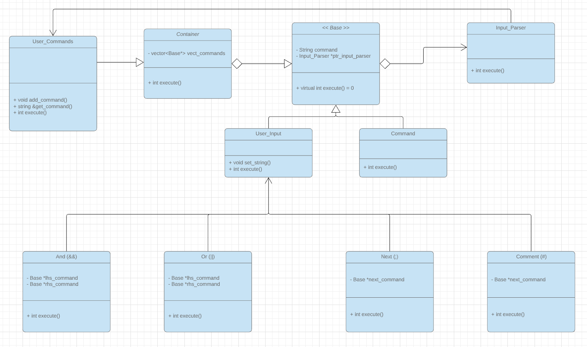

# RSH - rShell

rShell is a legacy remote shell tool that allows running commands on a remote computer. This project is simply a recreation of the rsh to simulate its behavior and practice design patterns with recursive composition in C++.

To learn more about the rsh, please visit https://www.ssh.com/ssh/rsh

## Introduction
This project entails the creation of a basic, remote command shell that incorporates the following functionality:
1. Prints a command prompt with the current user
2. Read a line of user commands from standard input
3. Parse user commands from input
4. Execute the commands utilizing fork(), execvp() and waitpid() UNIX commands
5. Verification of execution via GoogleTest

## Project Structure
This project implements a composite pattern to provide a container of commands as well as a nested tree structure that is required to execute the logical implementation of connectors. Strategically opted to utilize header files to prevent directory pollution. With this being said, having all code provided in each respective header file allows for readability and concise code implementation.



## Planned Functionality
1. Bash commands (e.g. mkdir, echo, ls, exit, etc.)
2. Connector functionality executed via a logical tree structure
3. Connector functionality includes: ```And: &&,  Or: ||```
4. Utilizing the logical tree structure, execute return values recursively traverse back up the tree

## Known Bugs
1. None yet, let's keep it that way!


## GoogleTest Implementation
GoogleTest will be used to implement and test logical connectors via its tree structure.
